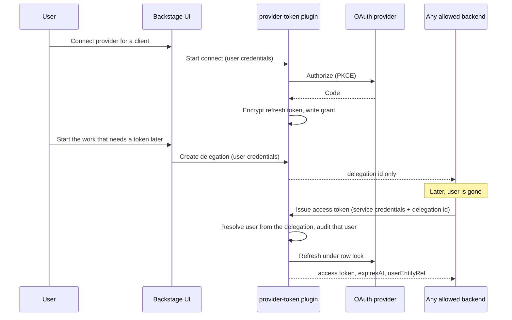

# PLAN-RHIDP-1661 — Provider token storage POC

Status: **draft for review. No code until this plan is accepted.**

Task: [RHIDP-1661](../context/RHIDP-1661.md) (same feature as RHDHPLAN-1661). Server-side storage of upstream provider refresh material so a trusted backend can mint short-lived user access tokens after the browser is gone.

Refinement file: skipped. The request is an implementation plan, and placement is already chosen: a separate plugin, validated outside this monorepo, shaped so a later core proposal is a move rather than a rewrite.

This repository (`backstage/backstage`) is the discovery baseline only. The POC does not patch it.

## Discovery summary

What exists today:

- Provider refresh tokens live in httpOnly cookies (`OAuthCookieManager` in `@backstage/plugin-auth-node`). The cookie path is the auth provider path. Backend plugins and external processes cannot read them.
- `OAuthRouteHandlersOptions` has no store hook. Persisting tokens from the normal sign-in flow requires a change to `createOAuthRouteHandlers`.
- `OfflineSessionDatabase` / `OfflineAccessService` (`auth.experimentalRefreshToken`) store **Backstage-issued** refresh sessions for CLI and MCP clients ([issue #30066](https://github.com/backstage/backstage/issues/30066), now closed). That is a different credential. Those tables are not a place to put GitHub or Microsoft refresh tokens.
- GitHub’s authenticator, when the provider returns no refresh token and no expiry, stores the access token itself under an `access-token-v2.` prefix and treats it as the refresh cookie. That is a non-expiring user access token. The feature rejects long-lived personal tokens as the product path, so the POC must refuse this shape.
- Microsoft’s authenticator already requests `offline_access` and can refresh. Access tokens are typically about 60–90 minutes. Refresh tokens rotate.
- Service callers authenticate with `AuthService` / `HttpAuthService`. In-process plugins get a subject `plugin:<pluginId>` (`PluginTokenHandler`). External callers use `backend.auth.externalAccess` (static token or JWKS) and a configured subject. `accessRestrictions.permission` applies only on routes that actually call the permission API.
- `BackstageServicePrincipal.subject` is documented as informational and not a stable authorization API. The POC still needs a caller identity. The enforcement stack below does not treat an unverified string as that identity.
- There is no AES-GCM helper in this repo. Encryption is new code in the plugin.
- A fork PR ([sonjaer/backstage#1](https://github.com/sonjaer/backstage/pull/1)) is a useful design reference: encrypted rows, a grant table, a service-only connect call, consent reuse. It is not the implementation to copy. It writes tokens during ordinary sign-in, and it authorizes from the service subject alone. Rugvip’s review asks for a client service (so callers do not depend on HTTP), a return URL plus polling, and a way to limit which service subjects can call the API. Permission policies are a poor fit for “which service is allowed,” because that framework is user-centric.

## Placement

| Piece                                                                                                                                                        | Where                                                                                                                                 |
| ------------------------------------------------------------------------------------------------------------------------------------------------------------ | ------------------------------------------------------------------------------------------------------------------------------------- |
| POC plugin (storage, connect, issue, revoke, settings page)                                                                                                  | New repo. Not this checkout.                                                                                                          |
| Any backend that needs a short-lived user provider token (Orchestrator is the first consumer named by the ticket; Scaffolder and others use the same client) | That plugin’s owners. They store a delegation id and call the issue API. They do not own refresh material.                            |
| Later core adoption                                                                                                                                          | A proposal against auth, after the POC has users. Preferred shape: this service and its `-node` client, not a cookie hook on sign-in. |

Package roles (prefix follows the destination repo; plugin id stays `provider-token`):

| Package                                          | Role                                                                     |
| ------------------------------------------------ | ------------------------------------------------------------------------ |
| `plugin-provider-token-common`                   | Types, permission definitions, error names                               |
| `plugin-provider-token-node`                     | Extension point for provider modules, and the client other backends call |
| `plugin-provider-token-backend`                  | Database, encryption, routes, consent, issue, revoke                     |
| `plugin-provider-token-backend-module-github`    | GitHub authorize / refresh / revoke                                      |
| `plugin-provider-token-backend-module-microsoft` | Microsoft authorize / refresh                                            |
| `plugin-provider-token`                          | One user page: list and revoke                                           |

One changeset in that repo when more than one of those packages is published. No changeset in this monorepo.

### Upstream vs local

- **Classification:** Local plugin for the POC. Upstream/system for anything that would edit `@backstage/plugin-auth-node`, `@backstage/plugin-auth-backend`, or the example app here.
- **Why:** Refresh material is trapped in cookies, and there is no extension point to intercept it. Issue #30066 Part 2 is one paragraph on a closed issue. Offline sessions solve a different problem.
- **Minimal repro for a later upstream conversation:** a backend plugin cannot read `<provider>-refresh-token`, and `OAuthRouteHandlersOptions` has nowhere to register a store. GitHub’s non-expiring access-token fallback shows why “save whatever the cookie flow already has” is the wrong default.
- **Next actions:** Build the plugin in its own repo. After it works for one consumer, open or revive an upstream issue that proposes the service interface (Rugvip asked for an alpha client on `@backstage/plugin-auth-node`). Do not open that as a drive-by patch to this tree.
- **Stop line:** No edits under `plugins/auth-*` or `packages/` in this repo as part of the POC.

## Decision

The POC is its own OAuth client and its own consent, not a tap on the sign-in cookies.

Three records, with different lifetimes:

1. **Secret** — one per user and provider. The refresh token, encrypted. The only copy of long-lived provider material.
2. **Grant** — the user’s consent that a named **client** may use that secret. A client is any caller: a plugin id, an external service, or both. Scopes are the maximum that client may receive. Orchestrator is one client in config, not a special case in the schema.
3. **Delegation** — an opaque id created while the user is present. The caller stores this id. Call-time minting presents the id plus the service credential. The issue request does not accept a user. The user is already stored on the delegation (taken from the user credentials at create time) and is written on every mint audit event. A stolen service credential can mint only for delegations that user already created.

Callers receive a short-lived access token and an expiry. They never receive the refresh token, the secret row, or the encryption key.



### Modular vs direct

**Modular.** GitHub and Microsoft differ in a way that will leak into the router if they share one code path: GitHub must reject non-expiring access tokens; Microsoft refresh tokens rotate and are audience-specific. Provider behavior is an extension point on `plugin-provider-token-node`:

- `id`
- `buildAuthorizeUrl`
- `exchangeCode`
- `refresh`
- `revoke` (optional; absence means local delete only)

The backend plugin owns storage, consent, locking, audit, and HTTP. A second module registering the same `id` fails process startup. If the GitHub module is not installed, GitHub connect fails with a clear error and Microsoft still works.

Direct implementation inside one router would be a rewrite as soon as a third provider appears. The ticket names GitHub and Microsoft as the first two consumers of that extension point, not as the only providers the service can hold.

### How generic the providers are

The storage, consent, delegation, issue, and revoke path is provider-neutral. A provider module is the OAuth dialect: authorize URL, token URL, and how a refresh response is interpreted.

| Fit                                                   | Providers in this repo                                                                                                                                       | What the POC needs                                                                                                                                     |
| ----------------------------------------------------- | ------------------------------------------------------------------------------------------------------------------------------------------------------------ | ------------------------------------------------------------------------------------------------------------------------------------------------------ |
| Standard authorization-code plus a real refresh token | Google, GitLab, Auth0, Okta, OneLogin, OIDC, the generic OAuth2 provider, Bitbucket, Atlassian, OpenShift, VMware Cloud, Pinniped (when it is OIDC)          | One config-driven OAuth2 module: client id, client secret, URLs, scopes. Refuse the connect when the token response has no refresh token or no expiry. |
| Same flow, with a local quirk                         | GitHub (non-expiring access tokens must be refused; App and OAuth-app token URLs differ). Microsoft (audience is per provider id, `offline_access` required) | A thin module, or a hook on the generic module, for that quirk only.                                                                                   |
| No refresh material exists                            | Guest, and the header/proxy providers (GCP IAP, AWS ALB, Azure Easy Auth, Cloudflare Access, oauth2-proxy)                                                   | Out of reach. There is no upstream token to store. Issue #30066 makes the same point about proxy sign-in.                                              |

So: most OAuth and OIDC providers, via one generic module plus small hooks. Not every Backstage auth provider. GitHub and Microsoft ship in the POC because the ticket requires them; adding GitLab or Google later is configuration, or a hook, without a new HTTP API.

Atlassian-style refresh rotation (the previous refresh token dies when a new one is issued) is why the row lock and “save the new refresh token before returning the access token” rule is in the core service rather than in the Microsoft module.

## Security model

Trust boundary: refresh material stays in this plugin. The caller stores a delegation id. Any client listed in config may call the issue route. That client is trusted to present a delegation id it was given. It is not trusted to choose which user it acts as.

### Credential modes

| Route class                                                     | Principal                                   | What it may do                                                                  |
| --------------------------------------------------------------- | ------------------------------------------- | ------------------------------------------------------------------------------- |
| Connect start, consent approve, create delegation, list, revoke | `user`                                      | Act only as `credentials.principal.userEntityRef`                               |
| Issue access token                                              | `service`                                   | Mint a token for a delegation whose client lists this caller’s verified subject |
| OAuth callback                                                  | Browser redirect, no Backstage bearer token | Complete a single-use server-side connect session (state + PKCE)                |

Host auth does not automatically reject anonymous callers on a new plugin’s routes. Each JSON route uses `httpAuth.credentials` and allows one principal type. The callback is the exception, and it is bound to the connect session rather than to a second copy of the host’s anonymous policy.

`allowLimitedAccess` stays off. Cookie-scoped user tokens are not accepted on these routes.

### Who may mint a token

All of the following, in the handler, even if the permission framework is disabled or returns allow:

1. Verified service principal from `httpAuth.credentials`. Subject and plugin id are never taken from the body or query.
2. Subject is listed on the grant’s **client** in config (`allowedSubjects`).
3. Delegation id hashes to an active row, the grant is active, and the requested scopes are a subset of the grant.
4. `permissions.authorize` is also called, with `provider-token.access-token.issue`. That is what makes `backend.auth.externalAccess[].accessRestrictions.permission` able to limit an external token to this one action. A deny result fails the request. Conditional results are deny in the POC (no resource conditions yet).

An external caller (Orchestrator is the ticket’s example) is just an `externalAccess` entry whose subject is listed on one client. Token values stay in the deployment secret store:

```yaml
backend:
  auth:
    externalAccess:
      - type: static
        options:
          token: ${ORCHESTRATOR_BACKEND_TOKEN}
          subject: orchestrator
        accessRestrictions:
          - plugin: provider-token
            permission: provider-token.access-token.issue
```

In-process callers use `auth.getPluginRequestToken` targeted at plugin id `provider-token`. Their subject is `plugin:<pluginId>`. That string has to be listed under the client’s `allowedSubjects` if an in-process plugin is allowed to mint.

User list/revoke routes authorize `provider-token.grant.read` and `provider-token.grant.revoke`. The handler still filters by the authenticated user entity ref and ignores any user ref in the query. Resource-permission rules are a follow-up if an admin must revoke someone else’s grant. The POC does not include that admin path.

### Token handling

- Persist the refresh token only. Access tokens are not written to the database.
- Encrypt with AES-256-GCM. The key is a 32-byte value from config, never from the database. A `keyId` column selects the key. New writes use the first key. Reads use the row’s `keyId`. Additional authenticated data is the user entity ref and the provider id, so a ciphertext cannot be moved to another row and still decrypt.
- Payload includes a version byte so a later vault handle (`external-handle`) can share the column without an API change. The POC writes `oauth-refresh` only.
- A process-local cache holds the current access token until `expiresAt` minus 60 seconds, keyed by secret id and scope set. It is dropped on revoke in this process. It is not logged and not serialized. The cache exists so a rotating refresh token is not exercised on every workflow step. Revoke stops new refreshes immediately. An access token already issued, or cached on another pod, remains valid at the identity provider until that token’s own expiry (often under an hour). The settings page says that in plain language.
- Refresh runs inside a database transaction that locks the secret row (`FOR UPDATE` on Postgres) **across** the identity-provider call. The new refresh token is committed before the access token is returned. Two pods refreshing at once is how rotating refresh tokens get invalidated and the user looks “randomly disconnected.”
- If the provider returns a new refresh token and the database write fails, the row is marked unusable and the access token is not returned. The user reconnects. Serving the previous refresh token after a rotation is unsafe.
- SQLite cannot take that row lock. Log the same class of warning `OfflineAccessService` already logs, and keep an in-process single-flight map. Postgres is the production target.
- GitHub results that lack a real refresh token, lack an expiry, or use the `access-token-v2.` prefix are refused at connect time. The user sees an actionable error. Nothing is stored.
- Microsoft connect requests `offline_access`. One provider id is one audience (for example Graph). A later audience is another provider id on the same module, not a flag on the issue call. Scopes on the delegation are a subset of the grant. The refresh request asks for that subset and no more.
- On `invalid_grant` or an equivalent revocation from the provider: delete the ciphertext, revoke the grant and its delegations, audit the reason, and return a non-retryable error. The handler does not refresh again for that row.
- Delegation ids are 32 random bytes, shown to the caller once. The database stores a hash (same idea as `offline_sessions.token_hash`). A database read does not reveal a usable id.
- Connect sessions store the PKCE verifier encrypted, store a hash of `state`, expire in about 10 minutes, and are single-use.
- `returnUrl` is checked against a configured allow-list (origin and path prefix) before it is stored and again before redirect. The connect response never echoes an arbitrary URL.
- The user on a mint is the user entity ref stored on the delegation at create time. The issue request cannot override it. `access_token.issued` records that user, the client id, the verified service subject, the provider, the scopes, and the time. `last_used_at` on the delegation is the settings-page view of the same fact.
- The issue response echoes `userEntityRef` so the caller can write it next to its own task id. That echo is informational. Authorization still uses the row.
- Optional `context` on create-delegation and on issue is an opaque caller string (a workflow id, a scaffolder task id). It is stored on the audit event and labeled caller-supplied. It is not used to select a user, a grant, or a secret. The durable join, if the caller never sends context, is the caller’s own log of which task presented which delegation id.
- Logs, audit events, and error messages contain provider id, client id, user entity ref, delegation hash prefix, scopes, context, and a reason code. They do not contain access tokens, refresh tokens, authorization codes, PKCE verifiers, encryption keys, `Authorization` headers, or raw callback queries.

### Revocation

The user can, from the settings page:

- Revoke one delegation (that workflow cannot mint again).
- Revoke the grant (every delegation for that client and provider stops).
- Disconnect the provider (the secret row is removed, so every client loses it).

Local delete always happens. GitHub revoke also calls the provider’s token revocation endpoint as a best effort, then deletes the local secret even if GitHub is unreachable. The audit event records whether the upstream revoke succeeded. Microsoft has no equally narrow revoke; local delete stops this plugin from minting. The plan does not call tenant-wide sign-out revocation.

A refresh failure caused by the user revoking the app at GitHub or Entra uses the same local delete path.

### Errors

New failures use `@backstage/errors`. The unavailable case is a `CustomErrorBase` subclass:

- `name`: `ProviderTokenUnavailableError`
- `code`: `consent_missing`, `delegation_revoked`, `delegation_expired`, `refresh_rejected`, or `scope_exceeded`
- `retryable`: `false` for those codes

`serialize-error` keeps enumerable fields, so `code` and `retryable` are part of the standard error JSON. Callers branch on `name` and `code`, not on message text. Message text is the sentence a user can be shown.

`provider_unreachable` is a separate `ServiceUnavailable`-style error with `retryable: true`. The plugin does not loop. The caller may back off.

Validation failures are `InputError`. Bad credentials are `AuthenticationError`. Allow-list and permission failures are `NotAllowedError`. Unknown ids are `NotFoundError` (no distinct “expired” vs “missing” leak beyond the dedicated unavailable error for ids the caller is allowed to know).

### Audit and operational logs

Audit events go through a `LoggerService` child (`type: audit`) so they can be routed apart from request logs:

| Event                                                                                | When                                                                                                                                                  |
| ------------------------------------------------------------------------------------ | ----------------------------------------------------------------------------------------------------------------------------------------------------- |
| `connect.started`, `connect.approved`, `connect.denied`                              | Consent                                                                                                                                               |
| `delegation.created`, `delegation.revoked`, `grant.revoked`, `provider.disconnected` | User or refresh-failure revocation                                                                                                                    |
| `access_token.issued`                                                                | Successful mint. Includes the delegation’s user entity ref, client, service subject, provider, scopes, and optional caller `context`. No token value. |
| `refresh.failed`                                                                     | Provider rejected the refresh; includes `code` only                                                                                                   |
| `provider_revoke_failed`                                                             | Local revoke succeeded, upstream revoke did not                                                                                                       |

Operational logs are the usual request line: plugin, route, status, duration, provider id. Request bodies are not logged.

HTTP routes emit these from the router. The refresh path emits them from the service, including when a future non-HTTP caller uses the in-process client. One service method owns the audit call so the HTTP layer cannot forget it.

### Lifecycle

A timer deletes expired connect sessions and expired delegations. It is `unref`’d and cleared in `lifecycle.addShutdownHook`, same pattern as `OfflineAccessService`. The in-process refresh lock map and access-token cache live on the service object and are dropped when the process exits. No pool of our own; Knex comes from `DatabaseService`.

## HTTP contract

Stable enough that Orchestrator can keep calling it if the plugin later moves into core. Plugin id `provider-token`. Paths under the plugin API prefix.

| Method and path                          | Caller         | Body / result                                                                                                                       |
| ---------------------------------------- | -------------- | ----------------------------------------------------------------------------------------------------------------------------------- |
| `POST /v1/connect/sessions`              | User           | Provider id, client id, scopes. Returns a connect URL.                                                                              |
| `GET /v1/connect/sessions/:id`           | Browser        | Consent data: client title, provider, scopes, offline explanation. No secrets.                                                      |
| `POST /v1/connect/sessions/:id/decision` | Browser + user | Approve or deny.                                                                                                                    |
| `GET /v1/connect/callback`               | Browser        | Provider redirect. Completes the session.                                                                                           |
| `POST /v1/delegations`                   | User           | Client id, provider id, scopes, optional `context`. Returns `{ delegationId, expiresAt, userEntityRef }` once.                      |
| `POST /v1/access-tokens`                 | Service        | `{ delegationId, context? }`. Returns `{ token, expiresAt, scopes, userEntityRef }`. `userEntityRef` is copied from the delegation. |
| `GET /v1/grants`                         | User           | Own grants and delegations. No token fields in the schema.                                                                          |
| `DELETE /v1/delegations/:id`             | User           | Revoke one.                                                                                                                         |
| `DELETE /v1/grants/:id`                  | User           | Revoke client consent.                                                                                                              |
| `DELETE /v1/providers/:providerId`       | User           | Delete the secret and all grants for that provider.                                                                                 |

Zod (or the repo’s equivalent) validates every body, query, and path param: id alphabet and length, scope array size, provider id pattern, unknown keys rejected.

Intended callers: the Backstage UI (user routes) and any backend whose service subject is listed on a client (issue route). The `-node` client is how an in-process plugin calls it. An external process uses the same HTTP route with `externalAccess`. The issue response is a contract. Adding fields is fine. Renaming `token`, `expiresAt`, `userEntityRef`, error `name`, `code`, or `retryable` is a breaking change.

Connect completion for an external starter: the session includes the allow-listed `returnUrl`, and `GET /v1/connect/sessions/:id` is also readable by the user who started it so a UI can poll. Polling is the fallback Rugvip described. Events-service push is out of the POC.

## Configuration

Owned by the backend package `config.d.ts`. All keys are new. Default `enabled: false`.

```yaml
providerToken:
  enabled: true
  encryptionKeys:
    - id: v1
      key: ${PROVIDER_TOKEN_ENCRYPTION_KEY} # secret, base64, 32 bytes
  clients:
    - id: orchestrator
      title: Orchestrator
      allowedSubjects:
        - orchestrator
    - id: scaffolder
      title: Scaffolder
      allowedSubjects:
        - plugin:scaffolder
  returnUrlAllowlist:
    - https://portal.example.com/orchestrator
  delegationTtl: { hours: 24 }
```

Provider client id and client secret live on each module’s own keys, visibility secret, same operational class as existing auth provider config. The plugin does not read `auth.providers.*`.

| Key                                       | Purpose                                             | Default                    | Sensitivity           |
| ----------------------------------------- | --------------------------------------------------- | -------------------------- | --------------------- |
| `providerToken.enabled`                   | Registers routes and the cleanup timer              | `false`                    | operational           |
| `providerToken.encryptionKeys[].id`       | Key version stored on each row                      | required when enabled      | operational           |
| `providerToken.encryptionKeys[].key`      | AES-256-GCM key                                     | required when enabled      | secret                |
| `providerToken.clients`                   | Consent clients and which service subjects may mint | required when enabled      | operational           |
| `providerToken.returnUrlAllowlist`        | Redirect targets after connect                      | empty (no external return) | operational           |
| `providerToken.delegationTtl`             | Default delegation lifetime                         | 24 hours                   | operational           |
| module `clientId` / `clientSecret` / URLs | That provider’s OAuth app                           | required for that module   | secret for the secret |

Key rotation: prepend a new key, keep the old key in the list so existing rows decrypt, re-encrypt on the next successful refresh. Removing a key that still has rows is an operator error the startup check reports (count of rows left on a missing `keyId`, not the ciphertext).

No migration story for removed keys in the POC because nothing is shipping yet. The first public release should treat a rename of these keys as a major bump if any external adopter already has them.

## Persistence

Plugin-owned schema via `DatabaseService` (plugin id `provider-token`). Not the auth-backend tables.

| Table              | Holds                                                                                                      |
| ------------------ | ---------------------------------------------------------------------------------------------------------- |
| `secrets`          | user, provider, ciphertext, nonce, key id, payload version, scopes, updated time                           |
| `grants`           | user, client, provider, scopes, created, revoked                                                           |
| `delegations`      | hash of id, grant (and through it the user), expiry, last used, revoked, reason, optional caller `context` |
| `connect_sessions` | client, provider, encrypted verifier, state hash, return URL, expiry, consumed                             |

Unique active secret per user and provider. Unique active grant per user, client, and provider. Migrations are new tables only (safe for a rolling start). SQL stays valid on SQLite and Postgres; the row lock is the one Postgres-specific behavior, covered by a test on Postgres when CI has it and by the documented SQLite warning otherwise.

Cleanup of expired sessions is a short delete by timestamp, not a long lock.

## Registration / dependencies

- Backend plugin registers the provider extension point and reads it when the service starts.
- GitHub and Microsoft modules are optional peers. Absent module: that provider id fails closed. Present module: registered before routes serve traffic (normal backend startup order).
- The plugin does not require Orchestrator, catalog, or the permission backend to boot. Permission checks are still invoked; local principal and allow-list checks stand if the permission backend is absent.
- No second module may register provider id `github` or `microsoft`.

## Frontend

In scope because the request includes a place to see and revoke access. Bounded to one page in `plugin-provider-token`:

- Signed-in user’s grants (client title, provider, scopes, created).
- Delegations (created, expires, last used, revoke).
- Connect and disconnect.
- The page never has a token field, because the API does not return one.

Use existing layout components. If the work turns into new app navigation, a shared API client factory, or theming, stop and split that out. Tests stay at “renders own grants, revoke calls the API, token-like strings are absent.”

The consent screen can be this plugin’s route. It states the client title, the provider, the scopes, and that background jobs can keep acting as the user until they revoke.

## Phased breakdown

Each phase is mergeable on its own in the plugin repo. Tests for that phase land in the same phase.

### Phase 1 — Types, encryption, schema

- Common package: error class, permission objects, shared types.
- Encryption helper: round trip, wrong key, swapped additional authenticated data, key id selection.
- Knex migrations and database accessors on SQLite.
- No HTTP yet.

### Phase 2 — Refresh service and Microsoft module

- Extension point and Microsoft refresh against a mocked token endpoint.
- Row lock and single-flight: two overlapping refreshes result in one provider call and a stored rotated refresh token.
- Failed database write after rotation does not return an access token.
- `invalid_grant` deletes the secret and marks grants revoked.
- In-memory access-token cache invalidated on revoke.
- Cleanup timer registered with shutdown hook.

### Phase 3 — Issue, delegation, and user revoke API

- Routes above except the browser connect flow (delegations can be created against a fixture secret in tests).
- Service caller with a foreign subject is rejected.
- User caller cannot call `POST /v1/access-tokens`.
- Service caller cannot list or delete another user’s grants.
- Body `userEntityRef` is ignored / rejected if present.
- Revoked and expired delegations return `ProviderTokenUnavailableError` with `retryable: false`.
- Audit events asserted via the mock logger (and asserted absent: token strings).
- Permission deny blocks issue even when the subject is allow-listed.

### Phase 4 — Connect and consent

- PKCE, state hash, single-use session, expired session, return URL rejected when it is not on the allow-list.
- Approve writes secret and grant in one transaction.
- Second client for the same provider and a subset of scopes creates a grant only.
- Wider scopes require a new provider consent.
- Deny writes nothing.

### Phase 5 — GitHub module

- Successful path uses a real refresh token and an expiry.
- Non-expiring token, missing refresh token, and `access-token-v2.` prefix fail connect and leave the database empty.
- Best-effort upstream revoke on disconnect; local row is gone even when the revoke call fails.

### Phase 6 — Settings page

- List, revoke delegation, revoke grant, disconnect.
- Empty and error states.
- Stop if the UI scope grows past this page.

### Phase 7 — Node client

- `ProviderTokenApi.getAccessToken({ delegationId, credentials })` implemented over discovery + `AuthService`.
- In-process test: a tiny backend plugin calls the client and receives an access token.
- This is the surface to propose later as an alpha export from `@backstage/plugin-auth-node`, so Orchestrator does not bind to route paths forever.

## Testing strategy

| Layer                      | Where                                                                                                       | What                                                                                                                |
| -------------------------- | ----------------------------------------------------------------------------------------------------------- | ------------------------------------------------------------------------------------------------------------------- |
| Unit                       | Phases 1–2, 5                                                                                               | Encryption, scope subset, GitHub rejection, error `code` / `retryable`                                              |
| Backend integration        | Phases 3–4                                                                                                  | `startTestBackend` and `mockServices`: principal split, allow-list, permission deny, revoke then issue, two clients |
| Frontend                   | Phase 6                                                                                                     | Testing Library on the one page                                                                                     |
| e2e in this Backstage repo | N/A                                                                                                         | POC does not change this repo                                                                                       |
| Credential-backed e2e      | Follow-up in [rhdh-plugin-export-overlays](https://github.com/redhat-developer/rhdh-plugin-export-overlays) | Real Entra and GitHub apps. Backend-owned. Not a gate on the first plugin merge.                                    |

Postgres lock behavior: cover it when the plugin repo’s CI has Postgres; until then the SQLite tests cover the single-flight map and the code path still calls `forUpdate()`.

## Documentation

Ship with the POC:

- README threat model: what is stored, what callers receive, what revoke does and does not do (already-issued access tokens), GitHub expiring-token requirement, Postgres vs SQLite, config table above.
- `config.d.ts` kept in sync with the keys.
- OpenAPI (or the repo’s `api-docs` equivalent) generated when the routes exist.
- Contributor notes: tests run with mocked providers; no real client secrets in the repo.

Follow-up, not this plugin’s first merge:

- Orchestrator auth docs for queued workflows (the ticket’s doc epic).
- Security review write-up tracked with RHIDP-15381, using the audit list and threat model in this plan as the input.
- Upstream issue describing the `-node` client and explicitly excluding the sign-in cookie hook.

## Consider for review

1. **Delegation ids vs `userEntityRef` on the issue call.** Delegations stay the recommendation. The user is stored on the delegation and copied into the audit event and the issue response. The request does not accept a user, because a service that can pass any user ref can mint for every user who ever consented. Confirm this extra table is wanted in the first POC.
2. **Separate OAuth app vs reusing the sign-in app.** Separate is the recommendation: consent text can talk about background use, and disconnect does not have to log the user out of Backstage. Cost is another app registration for GitHub and Entra. Reusing the sign-in client still would not let this plugin see the existing cookies without a core change.
3. **GitHub non-expiring tokens are refused.** Customers on classic OAuth apps that only issue non-expiring user tokens cannot use the GitHub module until those apps enable expiring user tokens or a GitHub App user-to-server flow. That matches the ticket’s rejection of PATs. Confirm those customers are not the POC audience.
4. **One Microsoft provider id per audience.** Keeps the issue API a single access token. OBO (RHDHPLAN-653) stays out of scope; the stored refresh token is what a later exchange would use. Confirm Graph is the POC audience.
5. **Permission check plus allow-list.** Rugvip noted that the permission framework is user-centric. The allow-list is the service policy. The permission check exists so `externalAccess` restrictions actually bind. Confirm both stay.
6. **No access-token cache in the database, short cache in memory.** Revoke is immediate for new mints, not for tokens already handed out. Confirm the settings copy is enough.
7. **Frontend stays one page** owned with the backend POC. Confirm before Phase 6 if a frontend owner should take it instead.
8. **Vault / external token gateway.** Not in the POC. The payload version byte is the seam. Confirm we are not expected to integrate a vault before the first working Microsoft loop.

## Out of scope

- Patches to this Backstage checkout.
- Personal access tokens, and the GitHub non-expiring access-token fallback.
- Popup re-auth as the way to keep a queued workflow alive.
- Azure on-behalf-of exchange.
- Moving Scaffolder onto this API.
- Promising runs longer than the identity provider’s refresh or consent lifetime.
- Admin UI that revokes another user’s grants.
- SonataFlow changes (it should store the delegation id and call the issue route).

## Compliance and contracts

Folded from the refinement bar so a later review does not re-derive them.

| Area                     | Decision                                                                                                                                                                                                                                                        |
| ------------------------ | --------------------------------------------------------------------------------------------------------------------------------------------------------------------------------------------------------------------------------------------------------------- |
| Permissions and identity | User routes vs service issue route, as in the table above. Local checks always run. `provider-token.access-token.issue`, `provider-token.grant.read`, and `provider-token.grant.revoke` are basic permissions. Resource rules are a follow-up for admin revoke. |
| Audit                    | Events listed above, including non-HTTP refresh inside the service.                                                                                                                                                                                             |
| Operational logging      | Structured logs, no bodies, no credentials.                                                                                                                                                                                                                     |
| Validation               | Zod at the HTTP boundary. Scope subset checked again in the service.                                                                                                                                                                                            |
| HTTP contract            | User UI and Orchestrator. `token`, `expiresAt`, error `name`, `code`, and `retryable` are the stable fields.                                                                                                                                                    |
| Errors                   | `@backstage/errors` plus `ProviderTokenUnavailableError`.                                                                                                                                                                                                       |
| Configuration            | New keys only, schema in the backend package, secrets called out. First release: incompatible renames are a major bump.                                                                                                                                         |
| Lifecycle                | Cleanup timer plus shutdown hook. Refresh lock is per call, not a leaked timer.                                                                                                                                                                                 |
| Persistence              | Plugin-owned tables. SQLite for tests, Postgres row lock in production.                                                                                                                                                                                         |
| Modules                  | Optional provider modules. Duplicate ids fail startup.                                                                                                                                                                                                          |
| Testing                  | Unit and backend integration in the plugin repo. Overlays e2e is a follow-up. This repo’s e2e is N/A.                                                                                                                                                           |
| Docs                     | README, config schema, OpenAPI with the feature. Product docs are a follow-up.                                                                                                                                                                                  |
| Secrets                  | Placeholders only. Refresh tokens encrypted. Delegation ids stored as hashes. Access tokens memory-only.                                                                                                                                                        |

## Session handoff

- **Stopped after:** Discovery and this plan. No code.
- **Touched paths:** `.cursor/plans/PLAN-RHIDP-1661.md` only.
- **Commands run:** None (planning only).
- **Next step:** Confirm the discussion notes (generic OAuth module, user echoed from the delegation, clients are any plugin). Then review the items under “Consider for review.” After an explicit go-ahead, create the plugin repo and implement Phase 1 there. Do not start in this monorepo.
- **Open questions:** Destination repo and package scope prefix. POC Microsoft audience (assumed Graph). Whether Phase 6 stays with the same owner. Whether the first coded provider module is the generic OAuth2 module, with GitHub and Microsoft as config plus hooks.
