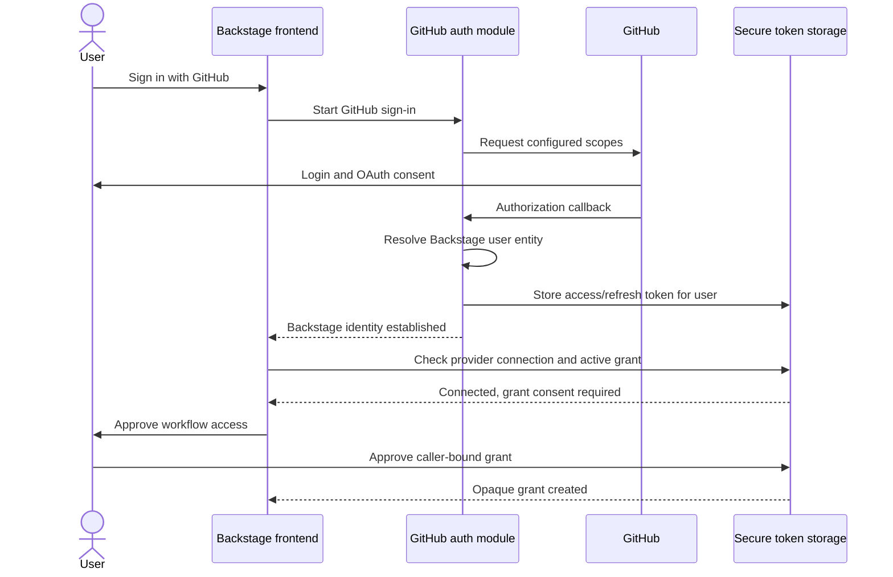

# RHIDP-15907: login-integrated GitHub connection option

## Status

This document records a possible follow-up design. It is not implemented and
does not replace the current separate provider connection flow.

## Goal

Allow a user to sign in to Backstage with GitHub and store the resulting
provider credentials in secure token storage as part of the same GitHub OAuth
flow. The user should not have to visit the Provider connections page and
start a second GitHub authorization flow.

The existing behavior must remain available when this integration is disabled.

## Summary

Add an optional, GitHub-specific auth backend module that replaces Backstage's
standard GitHub provider module. It would reuse Backstage's exported GitHub
authenticator, resolve the Backstage user, and pass the server-side OAuth
session to the existing `SecureTokenStorageService` interface.

The OAuth result would be stored as a provider connection during sign-in. The
caller-bound workflow grant should still require an explicit user decision
unless the sign-in experience clearly states that signing in also authorizes a
specific trusted caller.

This is a provider-specific adapter at the Backstage auth seam. It is not the
generic provider-token persistence seam that would ideally be added upstream
to `auth-node` and `auth-backend`.

## Proposed user flow



The final internal consent step does not contact GitHub again. It authorizes a
specific Backstage service subject, such as `sonataflow`, to exchange an opaque
grant for the stored provider access token.

## Proposed package

```text
workspaces/secure-token-storage/
  plugins/
    auth-backend-module-secure-token-storage-github/
```

Suggested package name:

```text
@red-hat-developer-hub/backstage-plugin-auth-backend-module-secure-token-storage-github
```

The module would:

1. Register provider ID `github` through Backstage's
   `authProvidersExtensionPoint`.
2. Reuse the exported `githubAuthenticator` from
   `@backstage/plugin-auth-backend-module-github-provider`.
3. Reuse or wrap the standard GitHub sign-in resolver behavior.
4. Resolve the canonical Backstage user entity reference before storing
   provider credentials.
5. Call `SecureTokenStorageService.storeProviderToken` with the OAuth session.
6. Complete normal Backstage sign-in without returning refresh-token material
   to the frontend.

The standard GitHub provider module and the custom module must not both be
registered because both would attempt to own provider ID `github`.

## Proposed configuration

The exact configuration names are illustrative:

```yaml
auth:
  providers:
    github:
      development:
        clientId: ${GITHUB_CLIENT_ID}
        clientSecret: ${GITHUB_CLIENT_SECRET}
        additionalScopes:
          - repo
          - read:org
        signIn:
          resolvers:
            - resolver: usernameMatchingUserEntityName

secureTokenStorage:
  enabled: true
  authIntegration:
    github:
      enabled: true
      callerSubject: sonataflow
      grantConsent: required
      failureMode: allow-login
```

Backstage's GitHub authenticator always requests `read:user`, so it does not
need to be repeated in `additionalScopes`.

`failureMode: allow-login` would preserve Backstage availability if encrypted
provider-token storage fails. The user could still sign in, receive a visible
connection warning, and use the existing connection flow as a fallback. A
stricter deployment could choose to fail the login instead.

## Backend changes

### Auth adapter

The auth module should keep provider-specific behavior local. Its narrow
interface with secure token storage remains the existing provider-agnostic
`storeProviderToken` operation.

The adapter must normalize the GitHub OAuth session carefully:

- Store the access token only after the catalog user is resolved.
- Parse the granted scopes from the provider session.
- Derive `expiresAt` from `expiresInSeconds` when present.
- Store a refresh token only when GitHub issued a real expiring-token session.
- Do not persist Backstage's synthetic non-expiring GitHub refresh marker as a
  provider refresh token.
- Never log authorization codes, access tokens, refresh tokens, or OAuth
  response bodies.

### Existing-connection consent

The current approval operation requires a completed secure-token-storage OAuth
session. A login-captured provider connection would not have that session, so
the broker needs a user-authenticated path for creating a grant from an
existing connection.

One possible HTTP interface is:

```text
GET  /api/secure-token-storage/connections/github/status
POST /api/secure-token-storage/connections/github/grants
```

The GET response should expose only safe metadata such as connection state and
granted scopes. The POST route should derive all sensitive authorization
inputs from trusted state:

- user identity from verified Backstage user credentials;
- caller subject and allowed scopes from backend configuration;
- provider from the route;
- maximum grant lifetime from broker policy.

The browser must not be allowed to select an arbitrary caller subject or submit
provider tokens.

## Frontend changes

The secure-token-storage frontend plugin could add an optional app-root module
that runs after sign-in:

1. Check whether login integration is enabled.
2. Query the safe GitHub connection and grant status.
3. If the connection exists but no active grant exists, display a consent
   prompt or navigate to the Provider connections page.
4. After approval, return the user to the page they originally requested.
5. If login-time storage failed, explain the failure and retain the existing
   **Connect GitHub** action.

The bootstrap must avoid redirect loops and should remember a user's explicit
decision to defer or reject grant consent.

## Consent choices

### Recommended: separate internal grant consent

GitHub OAuth consent authorizes the Backstage OAuth application. It does not by
itself explain that `sonataflow` or another trusted service will be allowed to
retrieve an access token. Keeping a short internal consent step preserves that
distinction while eliminating the second GitHub OAuth flow.

### Alternative: create the grant during login

The login page could use an explicit action such as **Sign in with GitHub and
enable workflow access** and create the configured caller grant immediately.
This is a shorter flow, but the page must clearly identify the caller, scopes,
and grant lifetime. It should not be the default until product and security
owners confirm that this constitutes sufficient consent.

## Security and product tradeoffs

### Advantages

- One GitHub OAuth flow instead of separate sign-in and connection flows.
- Provider tokens stay on the backend and never pass through frontend code.
- The existing encrypted storage, audit, refresh, revocation, and caller checks
  remain authoritative.
- The adapter is opt-in, and ordinary Backstage auth remains unchanged when it
  is disabled.

### Costs and risks

- The integration is GitHub-specific; Microsoft and other providers need their
  own adapters until Backstage exposes a generic persistence seam.
- Every user signing in through this provider is asked for the configured
  scopes.
- GitHub's classic `repo` scope includes write access to private and public
  repositories; it is broader than listing private repositories alone.
- The custom module replaces the standard GitHub provider registration and
  must track compatible Backstage authenticator changes.
- Login and provider-token storage now share a failure path unless failures are
  deliberately handled as non-fatal.
- Capturing a provider connection during login does not remove the need for a
  clear caller-grant consent policy.

## Compatibility requirements

- The feature remains disabled by default.
- When disabled, the standard GitHub auth module and current Provider
  connections flow continue to work unchanged.
- Existing users and workflows that do not use secure token storage continue
  to use normal Backstage authentication and Orchestrator `authTokens`.
- Disconnecting secure token storage must not unexpectedly sign the user out of
  Backstage.
- Signing out of Backstage should not silently revoke a long-running workflow's
  grant unless that lifecycle is explicitly selected and documented.

## Possible implementation slices

### Slice 1: GitHub auth capture prototype

- Scaffold the optional auth backend module.
- Register the exported Backstage GitHub authenticator.
- Resolve the catalog user and store the provider session.
- Configure the sample backend to use the custom module instead of the standard
  GitHub provider module.
- Add tests proving that token values are sent only through the backend service
  interface and are never logged.

### Slice 2: existing-connection grant consent

- Add safe connection-status retrieval.
- Add a user-authenticated operation that creates a configured caller grant
  from an existing provider connection.
- Reuse the broker's scope, caller, expiry, audit, and revocation checks.

### Slice 3: post-login experience

- Add an opt-in frontend bootstrap or consent prompt.
- Return the user to their original route after approval.
- Preserve the manual connection action as a fallback.

### Slice 4: hardening

- Test real GitHub sessions with and without expiring user tokens enabled.
- Verify refresh-token rotation and non-expiring token behavior.
- Add login, consent, rejection, reconnect, refresh, revoke, and failure-mode
  integration coverage.
- Review requested scopes and consent language with product and security owners.

## Open decisions

1. Is requesting `repo` from every GitHub sign-in user acceptable?
2. Should grant creation require a separate internal consent step?
3. Should secure-token-storage failure block sign-in or allow login with a
   warning?
4. Does the integration apply to every GitHub user or only selected users and
   groups?
5. What grant lifetime should be created after login?
6. Should Backstage logout, provider disconnect, and grant revocation remain
   independent lifecycle events?
7. Is a GitHub-specific adapter acceptable for the prototype, or should work
   wait for a generic upstream Backstage provider-token persistence seam?

## Recommendation

Prototype the optional GitHub auth module with `failureMode: allow-login` and
retain a separate internal grant-consent step. This removes the duplicate
GitHub authorization while preserving explicit authorization of the workflow
caller and keeping the existing manual flow as a fallback.
