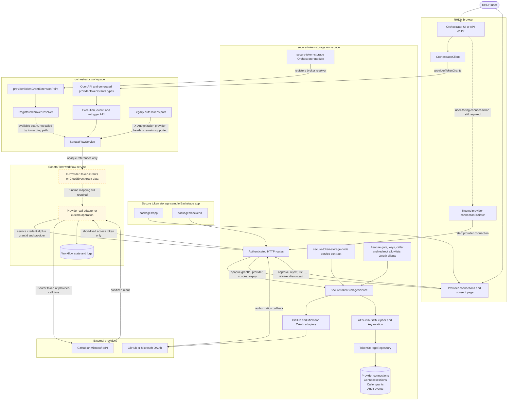

# RHIDP-15907: Secure token storage and Orchestrator flow

This document shows how the secure-token-storage workspace, its Backstage
integration, and the additive Orchestrator grant path fit together.

Solid lines represent implemented behavior. Dashed lines represent the
remaining user-facing or SonataFlow integration seams.

## Component flow



The provider access token exists only inside the broker and the provider-call
adapter. Refresh tokens remain inside the broker. Neither token belongs in
Orchestrator requests, workflow input, persisted workflow state, or logs.

## User and workflow sequence

```mermaid
sequenceDiagram
  actor User as RHDH user
  participant Initiator as Trusted workflow service
  participant Broker as Secure token broker
  participant DB as Encrypted database
  participant OAuth as GitHub or Microsoft OAuth
  participant Consent as Provider connections page
  participant Orch as Orchestrator backend
  participant Flow as SonataFlow runtime
  participant API as Provider API

  Note over User,Initiator: User-facing Orchestrator connection initiation is not wired yet
  Initiator->>Broker: POST /connections/provider/start with scopes and redirect URI
  Broker->>Broker: Verify service subject and allowlists
  Broker->>DB: Persist one-time connect session and encrypted PKCE verifier
  Broker-->>User: Redirect to provider authorization
  User->>OAuth: Authenticate and authorize requested scopes
  OAuth->>Broker: Callback with authorization code and state
  Broker->>DB: Consume and validate connect state
  Broker->>OAuth: Exchange code using GitHub or Microsoft adapter
  OAuth-->>Broker: Access token, optional refresh token, expiry, scopes
  Broker->>DB: Encrypt and store provider connection
  Broker-->>Consent: Redirect with session metadata only
  User->>Consent: Approve requested provider access
  Consent->>Broker: POST /connections/sessionId/consent
  Broker->>DB: Create grant bound to user, service subject, provider, scopes, and expiry
  Broker-->>Consent: Return opaque grantId

  Note over User,Orch: OrchestratorClient and API accept grants; UI selection is not wired yet
  User->>Orch: Execute or retrigger workflow with grantId and provider
  Orch->>Flow: Forward opaque grant in X-Provider-Token-Grants
  Note over Flow: Header-to-provider-call mapping remains to be finalized
  Flow->>Broker: POST /token with service credential and opaque grant
  Broker->>DB: Verify grant, caller, provider, expiry, and revocation

  alt Stored access token is still valid
    Broker->>DB: Decrypt access token and record grant use
  else Access token expired and refresh is available
    Broker->>DB: Decrypt refresh token
    Broker->>OAuth: Refresh through provider adapter
    OAuth-->>Broker: Rotated access and optional refresh token
    Broker->>DB: Atomically encrypt and replace token material
  else Grant or connection is unusable
    Broker-->>Flow: Stable secret-safe error
  end

  Broker-->>Flow: Short-lived access token, expiry, and approved scopes
  Flow->>API: Provider request with Bearer token
  API-->>Flow: Provider response
  Flow-->>Orch: Workflow result without token material
  Orch-->>User: Workflow status and sanitized output
```

## Implemented route families

| Route                                    | Credential                                | Purpose                                                      |
| ---------------------------------------- | ----------------------------------------- | ------------------------------------------------------------ |
| `POST /connections/:provider/start`      | User acting through a service, or service | Create persisted OAuth and PKCE connect state                |
| `GET /connections/:provider/callback`    | OAuth callback                            | Consume state, exchange the code, and store encrypted tokens |
| `POST /connections/:sessionId/consent`   | User                                      | Approve or reject access and create an opaque caller grant   |
| `GET /grants`                            | User                                      | List the user's grants without token material                |
| `POST /grants/:grantId/revoke`           | User                                      | Revoke one grant                                             |
| `POST /connections/:provider/disconnect` | User                                      | Revoke the provider connection and its grants                |
| `POST /token`                            | Service                                   | Validate a grant and return only a short-lived access token  |

## Current integration status

- Secure persistence, authenticated encryption, previous-key support, database
  migrations, persisted connect sessions, audit events, and grant lifecycle
  checks are implemented.
- GitHub and Microsoft authorization-code and refresh adapters are registered
  from configuration.
- The provider connections page supports consent, grant listing, revocation,
  and provider disconnection.
- Orchestrator's public API accepts additive `providerTokenGrants` for normal
  execution, event-triggered execution, and retriggering. Existing `authTokens`
  behavior remains available for compatibility.
- Orchestrator forwards opaque grants to SonataFlow as
  `X-Provider-Token-Grants`; event-triggered execution includes the same data
  in the CloudEvent payload.
- The secure-token-storage Orchestrator module registers the broker through the
  new Orchestrator extension point. The current SonataFlow forwarding path does
  not resolve grants inside the Orchestrator backend.
- The remaining end-to-end step is a SonataFlow runtime adapter that consumes
  the forwarded grant metadata, authenticates to `POST /token` using a
  secret-backed Backstage service credential, and injects the returned access
  token directly into the outbound provider request.

## Security boundary

```text
Browser and Orchestrator: opaque grant references only
Broker database: encrypted access and refresh tokens
SonataFlow call adapter: short-lived access token in memory only
Workflow state, output, and logs: no provider token material
```

## Implementation references

- [Implementation plan](./rhidp-15907-implementation-plan.md)
- [Extension-seam decision](./rhidp-15907-extension-seam.md)
- [Secure-token-storage routes](../workspaces/secure-token-storage/plugins/secure-token-storage-backend/src/router.ts)
- [Broker service](../workspaces/secure-token-storage/plugins/secure-token-storage-backend/src/service.ts)
- [GitHub and Microsoft adapters](../workspaces/secure-token-storage/plugins/secure-token-storage-backend/src/providers.ts)
- [Encrypted persistence](../workspaces/secure-token-storage/plugins/secure-token-storage-backend/src/database/repository.ts)
- [Provider connections page](../workspaces/secure-token-storage/packages/app/src/components/SecureTokenStoragePage.tsx)
- [Orchestrator registration module](../workspaces/secure-token-storage/plugins/secure-token-storage-backend/src/orchestrator-module.ts)
- [Orchestrator extension point](../workspaces/orchestrator/plugins/orchestrator-node/src/extensions.ts)
- [Orchestrator public contract](../workspaces/orchestrator/plugins/orchestrator-common/src/openapi/openapi.yaml)
- [Orchestrator frontend client](../workspaces/orchestrator/plugins/orchestrator/src/api/OrchestratorClient.ts)
- [SonataFlow grant forwarding](../workspaces/orchestrator/plugins/orchestrator-backend/src/service/SonataFlowService.ts)
